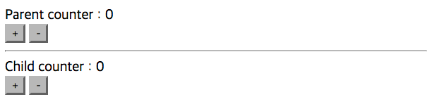

# Chapter 11 : Vuex를 이용한 상태 관리
## 11.1 왜 Vuex를 사용하는가?
Vuex는 Vue.js 애플리케이션에 대한 상태 관리 패턴 + 라이브러리 이다. 애플리케이션의 모든 컴포넌트에 대한 중앙 집중식 저장소 역할을 하며 예측 가능한 방식으로 상태를 변경할 수 있다. 또한 Vue의 공식 devtools 확장 프로그램과 통합되어 설정 시간이 필요 없는 디버깅 및 상태 스냅 샷 내보내기/가져오기와 같은 고급 기능을 제공한다.
### "상태 관리 패턴"이란 무엇인가?
간단한 Vue 가운터 앱부터 시작 해보자.
```
new Vue({
  // 상태
  data () {
    return {
      count: 0
    }
  },
  // 뷰
  template: `
    <div>{{ count }}</div>
  `,
  // 액션
  methods: {
    increment () {
      this.count++
    }
  }
})
```
다음과 같은 기능을 가진 앱이다.
* **상태**는 앱을 작동하는 원본 소스 이다.
* **뷰**는 상태의 선언적 매핑 이다.
* **액션**은 **뷰** 에서 사용자 입력에 대해 반응적으로 상태를 바꾸는 방법이다.


그러나 **공통의 상태를 공유하는 여러 컴포넌트** 가 있는 경우 단순함이 빠르게 저하 된다.

* 여러 뷰는 같은 상태에 의존한다.
* 서로 다른 뷰의 작업은 동일한 상태를 반영해야 할 수 있다.

첫번째 문제의 경우, 지나치게 중첩된 컴포넌트를 통과하는 prop는 장황할 수 있으며 형제 컴포넌트에서는 작동하지 않는다. 

두번째 문제의 경우 직접 부모/자식 인스턴스를 참조하거나 이벤트를 통해 상태의 여러 복사본을 변경 및 동기화 하려는 등의 해결 방법을 사용해야 한다. 이러한 패턴은 모두 부서지기 쉽고 유지보수가 불가능한 코드로 빠르게 변경된다.

이러한 이유로 Vuex와 같은 상태 관리 라이브러리를 사용한다. 정리 하자면 다음과 같다.
* 중앙 집중화된 상태 정보 관리가 필요하다.
* 상태 정보가 변경되는 상황과 시간을 추적하고 싶다.
* 컴포넌트에서 상태 정보를 안전하게 접근하고 싶다.

그렇다고 모든 애플리케이션 개발 시에 Vuex와 같은 상태 관리 라이브러리를 사용해야만 하는 것은 아니다. **간단한 구조의 애플리케이션 이라면 EventBus 객체의 사용 정도로도 충분히 해결될 수 있다.**

## 11.2 Vuex란?
Vue.js 의 상태관리 를 위한 패턴이자 라이브러리
### 상태관리(State Management)가 왜 필요한가?
컴포넌트 기반 프레임워크에서는 화면 구성을 위해 화면 단위를 매우 잘게 쪼개서 컴포넌트로 사용한다. 예를 들면, header, button, list 등의 작은 단위들이 컴포넌트가 되어 한 화면에서 많은 컴포넌트를 사용하게 된다. 이에 따라 컴포넌트 간의 통신이나 데이터 전달을 좀 더 유기적으로 관리할 필요성이 생긴다.

달리 말해, header -> button, button -> list , button -> footer 등의 컴포넌트 간 데이터 전달 및 이벤트 통신 등의 여러 컴포넌트의 관계를 한 곳에서 관리하기 쉽게 구조화 하는 것이 상태관리(State Management)이다.

## 11.3 상태와 변이
상태(state)와 변이(mutation)는 VueX 저장소(store) 내부의 핵심 요소이다. 상태는 애플리케이션에서 관리해야 할 중요한 데이터이며, 변이는 상태를 변경하는 함수들을 보유하고 있는 객체 이다. 전역에서 Vue.use(Vuex) 코드의 실행으로 애플리케이션 내부의 모든 컴포넌트가 저장소의 상태, 변이 객체에 접근할 수 있다. 상태는 반든시 변이를 통해서만 변경하도록 해야 한다.

### 11.3.1 간단한 Vue App 구성
Vuex 적용을 위해 Parent 컴포넌트와 Child 컴포넌트를 갖는 간단한 앱을 아래처럼 만들었다.



컴포넌트 폴더구조는 아래와 같다.


* App.vue : **Parent 컴포넌트** 또는 **상위 컴포넌트**
* Child.vue : **Child 컴포넌트** 또는 **하위 컴포넌트**
이 앱의 특징은 아래와 같다.
* 위 앱은 + 버튼 클릭 시 숫자가 올라가고, - 버튼 클릭 시 숫자가 감소된다.
* Parent 컴포넌트 - Child 컴포넌트 간 데이터 전달을 위해 [props](https://goo.gl/gYTXJB) 를 사용한다.
* 따라서, Parent counter 와 Child counter 는 같은 데이터 값 (counter) 을 공유하고 있다.

Parent 컴포넌트 (App.vue) 의 코드부터 보면
```
<!-- Parent (App.vue) Template -->
<div id="app">
  Parent counter : {{ counter }} <br>
  <button @click="addCounter">+</button>
  <button @click="subCounter">-</button>

  <!-- Child 컴포넌트를 등록하고 counter 데이터 속성을 props 로 전달한다. -->
  <child v-bind:passedCounter="counter"></child>
</div>
```
```
// App.vue
import Child from './Child.vue'

export default {
  data () {
    return {
      // data 속성 등록
      counter: 0
    }
  },
  methods: {
    // 이벤트 추가
    addCounter() {
      this.counter++;
    },
    subCounter() {
      this.counter--;
    }
  },
  components: {
    // Child 컴포넌트를 하위 컴포넌트로 등록
    'child': Child
  }
}
```
위 코드에서는 data 속성을 선언하고, 해당 data 속성을 증가 및 감소 시키는 이벤트를 등록하였다.

다음으로 Child 컴포넌트 코드를 보면,
```
<!-- Child (Child.vue) Template -->
<div>
  <hr>
  Child counter : {{ passedCounter }} <br>
  <button>+</button>
  <button>-</button>
</div>
```
```
// Child.vue
export default {
  // Parent 에서 넘겨준 counter 속성을 passedCounter 로 받음
  props: ['passedCounter']
}
```
template 의 경우 구분선을 제외하고는 Parent 컴포넌트와 동일한 코드고, js 의 경우 전달받은 counter 를 props 로 등록하였다.
### 11.3.2 Vue App 분석
위 앱의 + 버튼을 클릭하면 Parent 와 Child 컴포넌트의 숫자가 동일하게 올라간다.


이유는 Parent 의 counter 를 Child 에서 props 로 넘겨 받았기 때문이다.


달리 말해, **동일한 데이터 속성을 단지 2 개의 컴포넌트에서 동시에 접근하여 같은 값을 표현하고 있는 것이다.**

위 구조는 Vue 의 props 를 이용한 기본적인 Parent - Child 컴포넌트 통신이다. 화면의 단위를 잘게 쪼개면 쪼갤수록 한 컴포넌트의 데이터를 다른 컴포넌트의 화면에서 표시할 일이 많아진다. 여기서 컴포넌트의 갯수가 무한정 많아진다면? 천재가 아닌 이상 이걸 다 기억할 수도 없고, 가장 중요한 것은 협업하는 입장에서는 소스를 일일이 다 까봐야 추적이 가능하다.

**이런 비효율적인 컴포넌트 간 통신 관리를 Vuex 로 해결해보자.**

### 11.3.3Vuex 설치 및 등록
아래 명령어로 VueX 를 설치하자.
```
npm install vuex --save
```
그리고 Vuex 를 등록할 js 파일을 하나 새로 생성한다. 이름은 관례에 따라 store.js 로 지정한다.
```
// store.js
import Vue from 'vue'
import Vuex from 'vuex'

Vue.use(Vuex);

export const store = new Vuex.Store({
  //
});
```
그리고 Vue App이 등록된 main.js로 넘어가서 store.js를 불러와 등록하면 된다.
## 11.4 게터
## 11.5 액션
## 11.6 대규모 애플리케이션에서의 Vuex 사용
## 11.7 연락처 애플리케이션에 Vuex 적용하기

